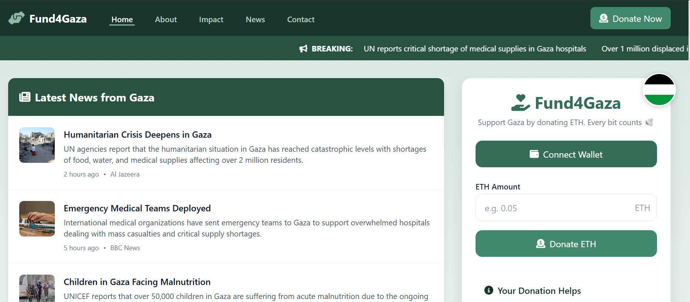
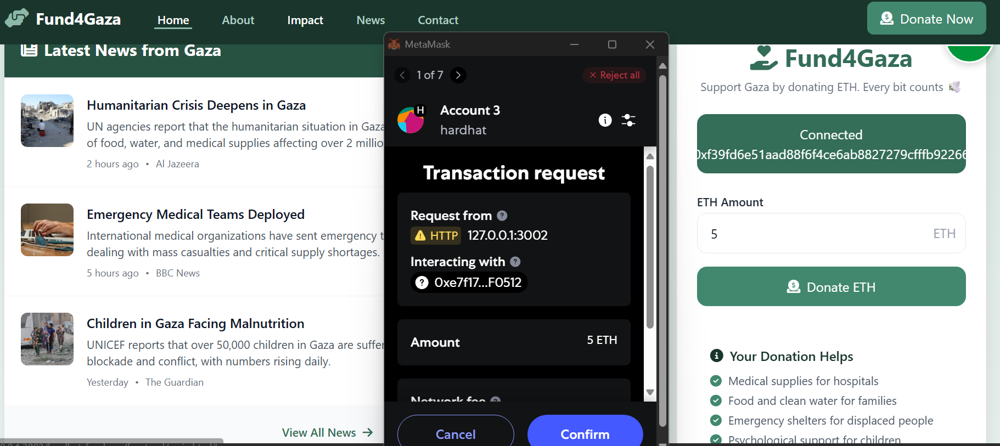
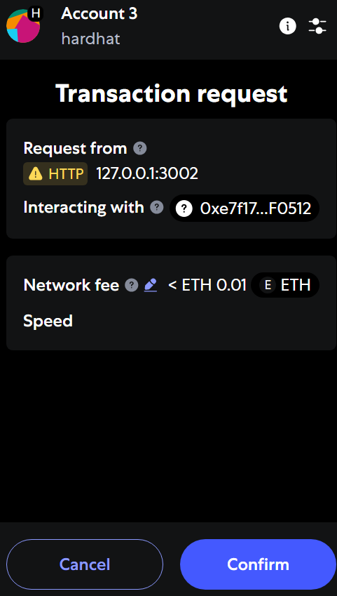
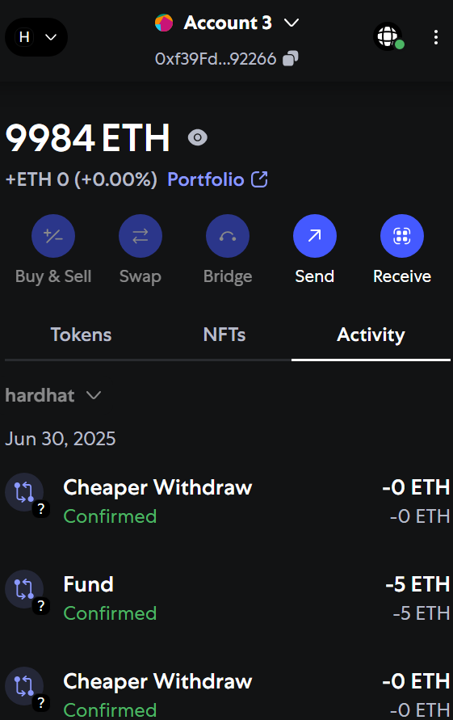
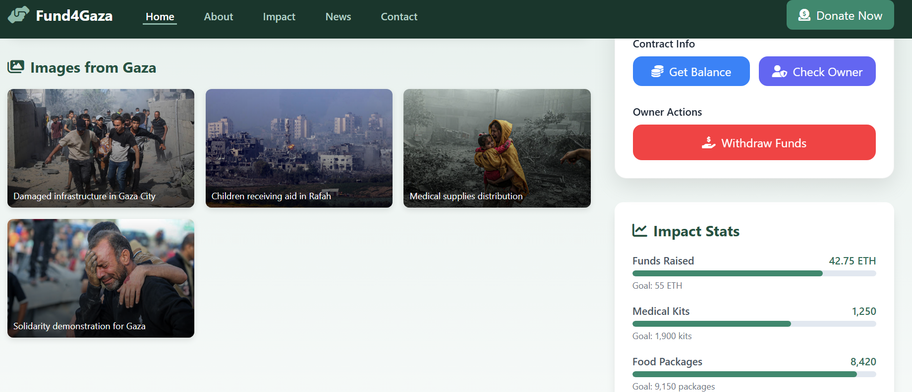
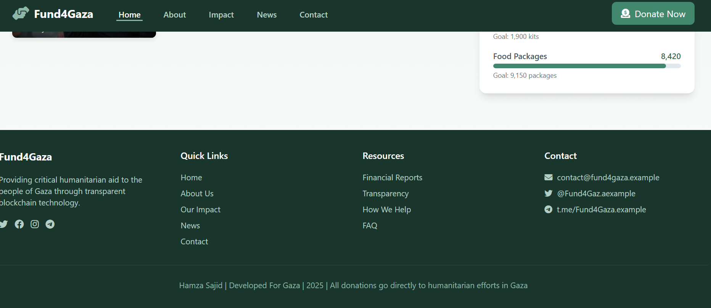
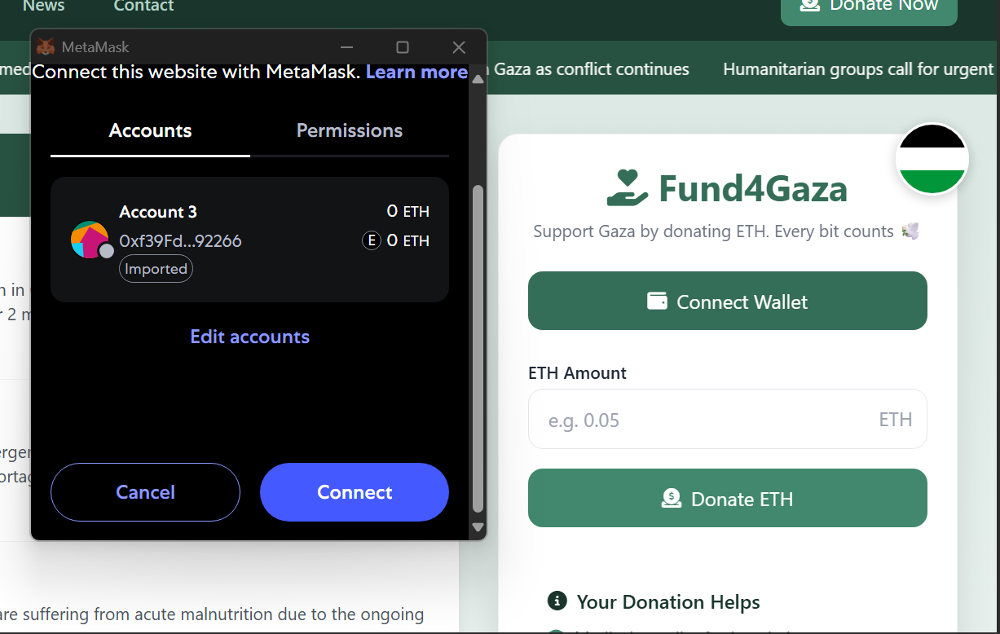
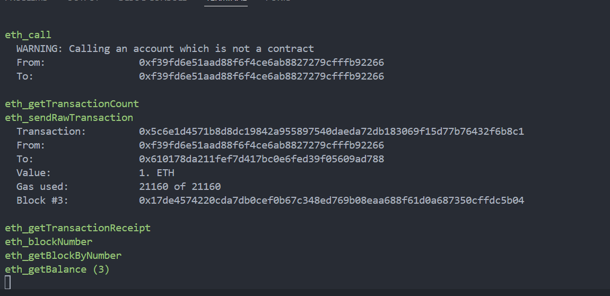
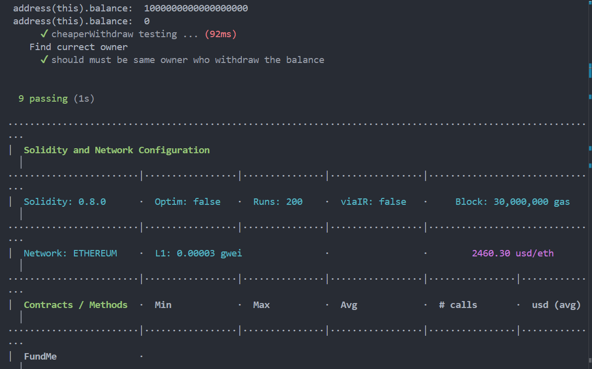

# fund4gaza Crowdfunding Project

This repository contains **fund4gaza**, a decentralized crowdfunding (FundMe) DApp built with Solidity and Hardhat. The project is specifically designed to support humanitarian relief for Gaza by enabling transparent and secure ETH donations. Anyone can contribute ETH, all funders are tracked on-chain, and only the contract owner can withdraw the collected funds. Chainlink price feeds ensure real-time ETH/USD conversion, and the project is fully tested and verified on the Sepolia testnet.

## Project Details

### Purpose
A blockchain-based crowdfunding platform for Gaza, wherae people can fund the cause transparently. Only the owner (project organizer) can withdraw the collected funds, ensuring security and accountability.

### How It Works
- **Funding:** Anyone can send ETH to the contract using the `fund` function. The contract checks the minimum USD value using Chainlink price feeds.
- **Tracking:** All funders and their contributions are tracked on-chain.
- **Withdrawal:** Only the contract owner can withdraw the total funds using the `withdraw` function.
- **Transparency:** All transactions are visible on the blockchain, and the contract is verified on Etherscan.

### Technologies Used
- **Solidity:** Smart contract language
- **Hardhat:** Development environment and testing framework
- **hardhat-deploy:** Automated deployment scripts
- **ethers.js:** Interact with Ethereum blockchain from JavaScript
- **Chainlink:** Decentralized price feeds for ETH/USD
- **Mocha & Chai:** Unit and staging testing
- **Solhint:** Solidity linter for code quality
- **solidity-coverage:** Code coverage for smart contracts
- **dotenv:** Manage environment variables

## Project Structure
```
hardhat-fund-me/
├── contracts/           # Solidity smart contracts
│   └── FundMe.sol
├── coverage/            # Coverage reports
├── deploy/              # Deployment scripts
│   ├── 00-deploy-mocks.js
│   └── 01-deploy-fundMe.js
├── deployments/         # Deployment artifacts
├── frontend/            # Frontend code (HTML/Tailwind CSS/JS)
├── ignition/            # Hardhat Ignition modules
├── node_modules/        # Node.js dependencies
├── script/              # Custom scripts (fund, withdraw, etc.)
│   ├── deployerBalance.js
│   ├── fund.js
│   └── withdraw.js
├── test/                # Unit and staging tests
│   └── staging/
│       └── FuneMe.staging.js
├── hardhat.config.js    # Hardhat configuration
├── helper-hardhat-config.js
├── utils/               # Utility scripts (e.g., contract verification)
├── .env                 # Environment variables
└── README.md            # Project documentation
```

## Getting Started

### Prerequisites
- Node.js (v18+ recommended)
- npm or yarn
- [Hardhat](https://hardhat.org/)

### Installation
1. Clone the repository:
   ```bash
   git clone https://github.com/HAMZOO0/Blockchain-Project.git
   cd hardhat-fund-me
   ```
2. Install dependencies:
   ```bash
   npm install
   # or
   yarn install
   ```

### Environment Variables
Create a `.env` file in the root directory and add:
```
INFURA_URL=your_infura_url
PRIVATE_KEY=your_private_key
COINMARKETCAP_API_KEY=your_coinmarketcap_api_key
ETHERSCAN_API_KEY=your_etherscan_api_key
```

> **Note:** This project uses [Chainlink](https://chain.link/) decentralized price feeds to ensure accurate ETH/USD conversion for minimum funding requirements. Make sure your network supports Chainlink or mocks are deployed for local testing.

## Deployment
To deploy the contract to Sepolia:
```bash
npx hardhat deploy --network sepolia
```

## Verification
After deployment, the contract is automatically verified on Etherscan if the API key is set.

## Testing
- **Unit Tests:**
  ```bash
  npx hardhat test
  ```
- **Staging Tests:**
  ```bash
  npx hardhat test --network sepolia
  ```

## NPM Scripts

The following scripts are available in the `package.json` for managing and testing your smart contracts:

| Script           | Description                                 |
|------------------|---------------------------------------------|
| `npm test`       | Run all unit tests with Hardhat              |
| `npm run test:staging` | Run tests on the Sepolia testnet         |
| `npm run test:local`   | Run tests on a local Hardhat/localhost node |
| `npm run coverage`     | Generate a Solidity code coverage report  |

You can run these scripts from the root of your project. For example:
```bash
npm run test:staging
```

## Interacting with the Contract
- Get contract address and ABI from Hardhat Deploy:
  ```js
  const FundMe = await deployments.get("FundMe");
  ```
- Use ethers.js or web3.js in your frontend to interact with the contract.

## Frontend
You can add your frontend code in the `frontend/` directory. Use JavaScript libraries like ethers.js or web3.js to connect to the deployed contract.

## Screenshots
Below are improved and organized screenshots of the DApp and its features:
<table>
  <tr>
    <td align="center"><b>Main Dashboard</b><br>
      
    </td>
    <td align="center"><b>Funding Page</b><br>
      
    </td>
  </tr>
  <tr>
    <td align="center"><b>Transaction Page</b><br>
      
    </td>
    <td align="center"><b>Additional UI</b><br>
      
    </td>
  </tr>
  <tr>
    <td align="center"><b>Transaction Proof</b><br>
      
    </td>
    <td align="center"><b>Web View</b><br>
      
    </td>
  </tr>
  <tr>
    <td align="center"><b>Footer</b><br>
      
    </td>
    <td align="center"><b>Withdraw</b><br>
      
    </td>
  </tr>
  <tr>
    <td align="center"><b>Hardhat Node Transaction</b><br>
      
    </td>
    <td align="center"><b>Unit Test and Gas Report</b><br>
      
    </td>
  </tr>
</table>


- [Verified Contract on Etherscan](https://sepolia.etherscan.io/address/0xd1ffeCD2602326350298F2CCfd7e5E86D65B4F62#code)
- [Chainlink Documentation](https://docs.chain.link/)
- [Hardhat Documentation](https://hardhat.org/docs)

## 🛠️ How Deployment Scripts Work (Key Points)

- **Deployment scripts are not stored on the blockchain.** They are JavaScript files that run on your computer to deploy contracts.
- **They run only when you deploy.** For example, when you run `npx hardhat deploy` or `npx hardhat test`, the scripts execute to set up your contracts.
- **Network-aware logic:** The script checks which network you are deploying to (local, testnet, mainnet) and makes decisions accordingly.
- **Mocks for local testing:** On local networks (like Hardhat/localhost), the script deploys a mock price feed and connects your contract to it.
- **Real addresses for testnet/mainnet:** On public networks, the script uses the real Chainlink price feed address.
- **One-time setup:** After deployment, the script does not run again unless you redeploy. The contracts live on the blockchain and are independent of the script.
- **Automated for tests:** When you run tests, Hardhat runs the deployment scripts first so your contracts are ready for testing.

---

Feel free to contribute or open issues for improvements!