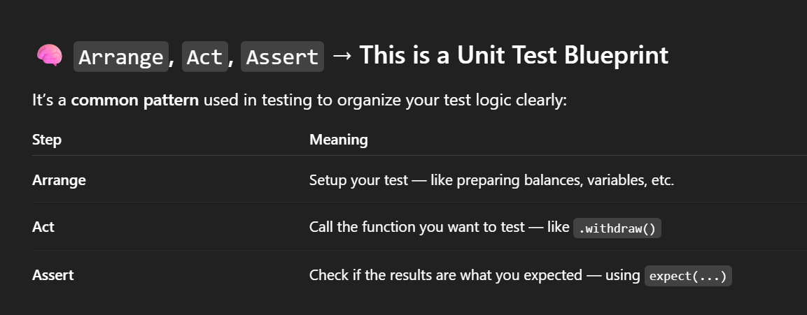

# FundMe Smart Contract

This project demonstrates a simple crowdfunding smart contract using Hardhat, deployed and verified on the Sepolia testnet.

## Deployment

To deploy the contract to Sepolia:

```bash
npx hardhat deploy --network sepolia
```

Sample output:
```
Nothing to compile
reusing "FundMe" at 0xd1ffeCD2602326350298F2CCfd7e5E86D65B4F62
Successfully submitted source code for contract contracts/FundMe.sol:FundMe at 0xd1ffeCD2602326350298F2CCfd7e5E86D65B4F62 for verification on the block explorer. Waiting for verification result...

Successfully verified contract FundMe on the block explorer.
https://sepolia.etherscan.io/address/0xd1ffeCD2602326350298F2CCfd7e5E86D65B4F62#code

Contract verified
```

---

## Testing

There are two types of tests:

1. **Unit Tests**: Run locally to test contract logic.
2. **Staging Tests**: Run on a testnet (e.g., Sepolia) to simulate real-world scenarios.

---

## Hardhat Deploy Helpers

- `getNamedAccounts()` returns named accounts, for example:
  ```js
  {
    deployer: '0xf39Fd6e51aad88F6F4ce6aB8827279cffFb92266',
    user: '0x70997970C51812dc3A010C7d01b50e0d17dc79C8'
  }
  ```

- To interact with the deployed contract:
  ```js
  // Get contract address and ABI from Hardhat Deploy
  FundMe = await deployments.get("FundMe");

  // Connect contract to a signer (wallet) to call functions like .fund(), .withdraw(), etc.
  ```

---

## Example



---

## Resources

- [Verified Contract on Etherscan](https://sepolia.etherscan.io/address/0xd1ffeCD2602326350298F2CCfd7e5E86D65B4F62#code)

---